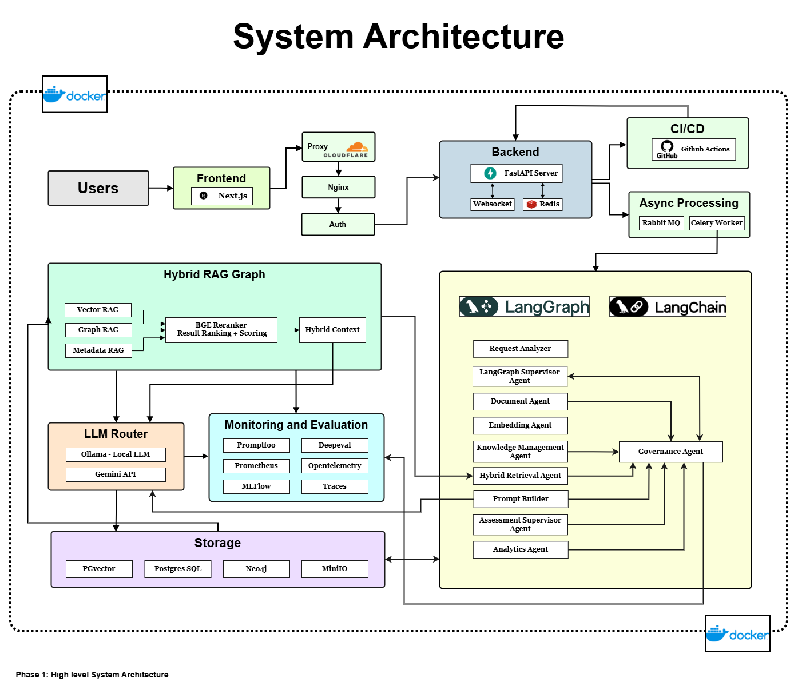
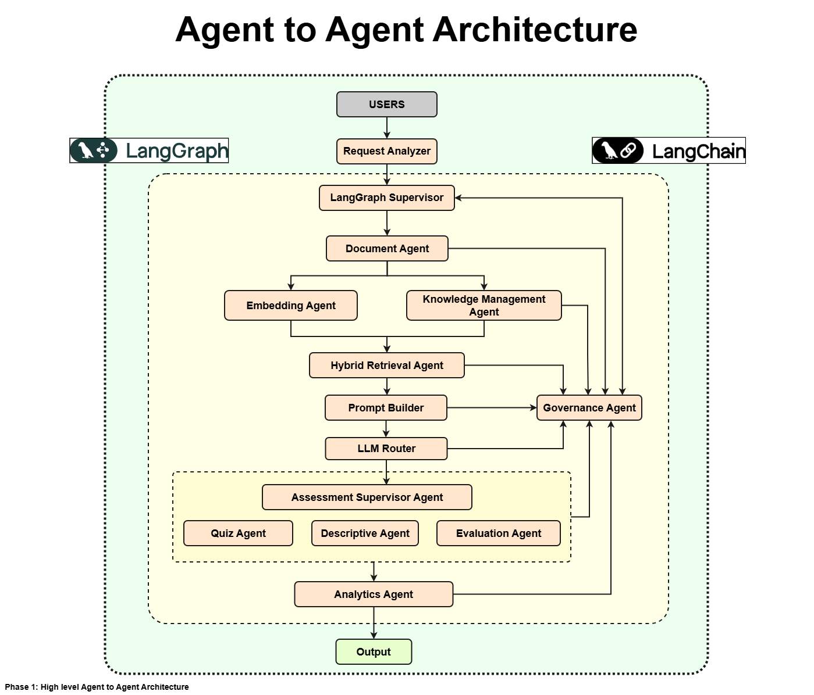

# Adaptive RAG-Powered Assessment & Learning Platform

> An open-source AI platform that combines **Hybrid RAG**, **Knowledge Graphs**, **Multi-Agent AI**, and **Adaptive Learning** to build intelligent assessments, personalized learning experiences, AI interviews, coding assessments, and enterprise knowledge evaluation. This platform helps students, developers, professionals, recruiters, educators, and enterprises continuously learn, evaluate, and improve.

> **Status:** 🚧 Phase 1 – Architecture Complete | Implementation In Progress

---

# The Problem

Today's learning and assessment ecosystem is fragmented.

Students use one platform for mock tests, developers use another for coding practice, recruiters rely on separate interview platforms, and enterprises maintain isolated training systems. Most of these tools operate independently, making it difficult to understand what a learner truly knows, where knowledge gaps exist, and how learning should adapt over time.

Traditional RAG systems retrieve relevant information effectively, but they often lack explicit reasoning over relationships between concepts and rarely adapt assessments or learning experiences based on a learner's evolving knowledge.

---

# The Vision

Instead of building separate applications for quizzes, coding challenges, interviews, and enterprise learning, this project builds a unified AI intelligence layer.

Every uploaded document is transformed into a structured knowledge base through document understanding, semantic retrieval, and knowledge graph construction. That intelligence powers:

- 📄 Intelligent document understanding
- 🧠 Hybrid RAG with Graph RAG
- 🌐 Knowledge Graph reasoning
- 📝 Adaptive AI-generated assessments
- 📊 Knowledge gap analysis
- 🎯 Personalized learning recommendations *(planned)*
- 💻 Coding assessments *(planned)*
- 🎤 AI interviews *(planned)*
- 🏢 Enterprise knowledge evaluation *(planned)*

The goal is to create a modular platform that serves multiple personas from a single architecture.

---

# Target Users

**Phase 1**
- 🎓 Students
- 👨‍💻 Developers
- 💼 Professionals

**Long-Term Vision**
- 👩‍🏫 Educators
- 🏢 Enterprises
- 🤝 Recruiters

---

# Phase 1

Phase 1 validates the complete adaptive assessment pipeline.

```text
Upload Document
        │
        ▼
Document Understanding
        │
        ▼
Knowledge Graph Construction
        │
        ▼
Hybrid Retrieval
        │
        ▼
Questions & Answering
        │
        ▼
Adaptive Quiz Generation
        │
        ▼
Knowledge Gap Identification
```

### Current Scope

- ✅ Intelligent document processing
- ✅ Hybrid RAG pipeline
- ✅ Knowledge Graph construction
- ✅ Graph-based question answering
- ✅ Adaptive assessment generation
- ✅ Knowledge gap analysis

### Out of Scope (Future Phases)

- Coding Assessments
- AI Interview Platform
- Recommendation Engine
- Adaptive Revision Engine

---

# Architecture

## Phase 1 System Architecture



---

## Phase 1 Agent-to-Agent Architecture



---

The platform is built around a **LangGraph-orchestrated multi-agent architecture**.

A **Request Analyzer** first understands the incoming request before handing control to the **LangGraph Supervisor**, which coordinates specialized agents responsible for document processing, knowledge management, hybrid retrieval, prompt construction, assessment generation, analytics, and governance.

Retrieval combines **Vector RAG**, **Graph RAG**, and **Metadata Retrieval**, followed by reranking to produce high-quality context before routing requests to the most appropriate language model.

The platform includes built-in observability using **Promptfoo**, **DeepEval**, **OpenTelemetry**, **Prometheus**, and **MLflow** to monitor system performance and evaluate response quality.

---

# Core Technologies

| Category | Technologies |
|----------|--------------|
| **Frontend** | Next.js |
| **Backend** | FastAPI, Redis, WebSockets |
| **Agent Framework** | LangGraph, LangChain |
| **LLMs** | Ollama, Google Gemini |
| **Retrieval** | PGVector, Neo4j, BGE-M3, BGE Reranker |
| **Storage** | PostgreSQL, MinIO |
| **Async Processing** | RabbitMQ, Celery |
| **Infrastructure** | Docker, GitHub Actions, Cloudflare, Nginx |
| **Evaluation & Monitoring** | Promptfoo, DeepEval, MLflow, Prometheus, OpenTelemetry |

---

# Repository Structure

```text
adaptive-assessment-platform/
│
├── docs/
│   └── architecture/
│       └── overview/
│           ├── phase1_system_architecture.drawio
│           ├── phase1_system_architecture.png
│           ├── phase1_agent_to_agent_architecture.drawio
│           └── phase1_agent_to_agent_architecture.png
│
├── LICENSE
└── README.md
```

> Detailed scope, system design, and agent-communication docs are coming in a follow-up commit as implementation progresses.

---

# Roadmap

## Phase 1

- ✅ Project Architecture
- ✅ System Design
- ✅ Agent Architecture
- ⬜ Backend Foundation
- ⬜ Frontend Foundation
- ⬜ Authentication
- ⬜ Document Processing Pipeline
- ⬜ Hybrid RAG
- ⬜ Knowledge Graph Integration
- ⬜ Adaptive Assessment Engine

## Phase 2

- ⬜ Coding Assessment Platform
- ⬜ AI Interview Platform
- ⬜ Learning Recommendation Engine
- ⬜ Analytics Dashboard
- ⬜ Enterprise Features

---

# Project Status

🚧 This project is currently under active development.

The architecture has been finalized, and implementation is underway. Features, APIs, and workflows will continue to evolve as the platform matures.

---

# Contributing

Contributions, discussions, and feedback are welcome.

Contribution guidelines will be added as the implementation reaches a stable foundation.

---

# License

Licensed under the **Apache License 2.0**.

See the [LICENSE](LICENSE) file for details.