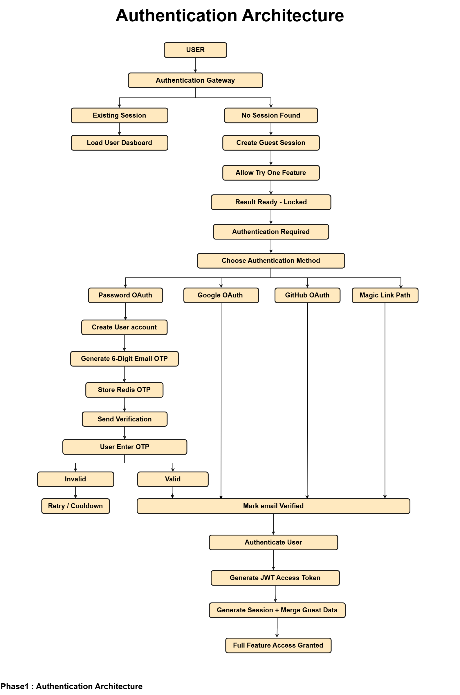

# 🔐 Authentication Implementation Plan

This document outlines the implementation roadmap for the Authentication module based on the Authentication Architecture. It complements the architecture document by defining the implementation scope, core components, and completion criteria for the Phase 1 MVP.

---

## 🎯 Scope

This implementation plan covers the complete Authentication module for the Phase 1 MVP, including:

- Guest-first authentication
- Email & Password authentication
- Email OTP verification
- Magic Link authentication
- JWT-based authentication
- Session management
- Role-Based Access Control (RBAC)
- Google OAuth
- GitHub OAuth

This document focuses on implementation requirements rather than architectural design.

---

## 🚀 Objectives

- Implement secure Email & Password authentication.
- Support a guest-first experience with seamless session migration.
- Verify users using Email OTP.
- Support passwordless authentication using Magic Links.
- Secure APIs using JWT access and refresh tokens.
- Protect authenticated resources using RBAC.
- Integrate Google OAuth and GitHub OAuth before the Phase 1 MVP release.

---

## 🧩 Components

### 👤 Guest Session

- Guest UUID generation
- Redis-backed guest session
- Secure, HttpOnly, SameSite cookie
- Session expiration
- Guest session migration after authentication
- Temporary storage of uploaded documents and assessment progress

---

### 🔑 User Authentication

- Email & Password registration
- Email OTP verification
- Magic Link authentication
- Login / Logout
- JWT Access Token (15 minutes)
- Refresh Token (7 days)
- Session management

---

### 🛡️ Authorization

Protected resources include:

- Dashboard
- Assessment History
- Download Reports
- Knowledge Graph Library
- AI Interviews
- Coding Assessments

---

### 🌐 OAuth

The following authentication providers are part of the Phase 1 MVP and will be implemented after the core authentication system is complete.

- Google OAuth
- GitHub OAuth

OAuth accounts should be linked to existing users using verified email addresses whenever possible to avoid duplicate accounts.

---

## 🗄️ Database Models

### 👤 User

- `id`
- `email`
- `password_hash` *(nullable for OAuth/Magic Link users)*
- `full_name`
- `role`
- `auth_provider` (`password`, `magic_link`, `google`, `github`)
- `is_verified`
- `is_active`
- `created_at`
- `updated_at`

---

### 🔄 RefreshToken

- `id`
- `user_id`
- `token_hash`
- `expires_at`
- `revoked`

---

### 💻 UserSession

- `id`
- `user_id`
- `device`
- `ip_address`
- `last_seen`
- `created_at`

---

### ✨ MagicLinkToken

- `id`
- `user_id`
- `token_hash`
- `expires_at`
- `used_at`
- `created_at`

---

## 🔌 API Endpoints

### 🔐 Authentication

| Method | Endpoint |
|---------|----------|
| POST | `/auth/register` |
| POST | `/auth/login` |
| POST | `/auth/logout` |
| POST | `/auth/refresh` |
| POST | `/auth/verify-email` |
| POST | `/auth/resend-otp` |
| POST | `/auth/magic-link` |
| GET | `/auth/magic-link/verify` |

---

### 🌐 OAuth

| Method | Endpoint |
|---------|----------|
| GET | `/auth/oauth/google` |
| GET | `/auth/oauth/google/callback` |
| GET | `/auth/oauth/github` |
| GET | `/auth/oauth/github/callback` |

---

### 👤 User

| Method | Endpoint |
|---------|----------|
| GET | `/users/me` |

---

## 🛡️ Security & Cross-Cutting Concerns

### 🔒 Security

- Argon2id password hashing
- JWT authentication
- JWT refresh token rotation
- Secure, HttpOnly, SameSite cookies
- Signed and time-limited Magic Links
- Single-use Magic Link tokens

### ⚙️ Reliability

- Redis-backed OTP storage
- Redis-backed guest sessions
- Rate limiting
- Bot protection (Cloudflare Turnstile or equivalent)

### 📋 Governance

- Audit logging
- Role-Based Access Control (RBAC)
- Account linking for OAuth providers

---

## 🔑 Authentication Methods

The Phase 1 MVP supports the following authentication methods:

| Method | Phase 1 |
|---------|:-------:|
| Email & Password | ✅ |
| Email OTP Verification | ✅ |
| Magic Link | ✅ |
| Google OAuth | ✅ |
| GitHub OAuth | ✅ |

---

## 🚫 Out of Scope

The following features are **not** included in the Phase 1 MVP:

- Forgot Password
- Reset Password
- Multi-Factor Authentication (MFA)
- Microsoft Entra ID
- OpenID Connect (OIDC)
- SAML
- Enterprise SSO

---

## ✅ Definition of Done

The Authentication module is considered complete when:

- Guest-first workflow is fully functional.
- Email & Password authentication is implemented.
- Email OTP verification is operational.
- Magic Link authentication is operational.
- JWT authentication and session management are complete.
- Guest sessions are successfully migrated after authentication.
- Google OAuth and GitHub OAuth are integrated.
- OAuth accounts are linked to existing users when appropriate.
- Protected routes enforce authorization correctly.
- Automated tests pass successfully.
- Documentation is complete and up to date.

---

## 📚 References

- `Phase1_authentication_architecture.drawio`
- `Phase1_authentication_architecture.png`