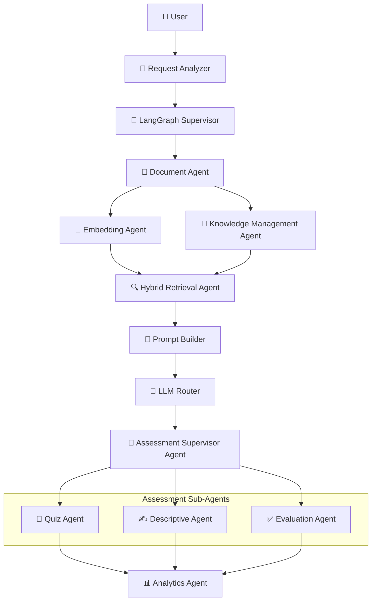

<h1 align="center">🚀 Phase 1 MVP</h1>

<h3 align="center">
Adaptive RAG-Powered Assessment &amp; Learning Platform
</h3>

> 🎯 **Goal:** Validate an end-to-end intelligent document assessment pipeline before expanding the platform to support coding assessments, AI interviews, personalized learning, and enterprise knowledge intelligence.

---

# 📌 Objective

Phase 1 establishes the core foundation of the platform by transforming uploaded documents into intelligent assessments using **Hybrid RAG**, **Knowledge Graphs**, and a **Multi-Agent AI architecture**.

> The primary objective is to build and validate the core document intelligence workflow that future platform capabilities will extend.

---

# 📋 Phase 1 Scope

During Phase 1, users will be able to:

- Register and authenticate
- Upload learning materials
- Process and understand documents
- Generate a knowledge graph
- Ask questions using Hybrid RAG
- Generate adaptive assessments
- Identify knowledge gaps

---

# 🔄 MVP Workflow

> 🛡️ The **Governance Agent** operates *across* the entire workflow — enforcing policy validation, access control, and response safety at every step.

---
# 🚀 Features

| Module | Description | Technologies / Components |
|--------|-------------|---------------------------|
| 🔐 **Authentication** | User registration, login, JWT-based authentication, and profile management | JWT, FastAPI |
| 📄 **Document Upload** | Upload and manage learning materials in multiple formats | PDF, DOCX, PPTX, XLSX, CSV, Images, Handwritten Documents |
| 📚 **Document Intelligence** | Parse and preprocess uploaded documents for downstream AI workflows | Document Parsing, OCR, Text Cleaning, Intelligent Chunking, Metadata Extraction |
| 🌐 **Knowledge Graph Generation** | Extract entities, concepts, relationships, and dependencies to build structured knowledge | Neo4j |
| 📦 **Embedding Pipeline** | Generate semantic embeddings and store them for retrieval | **BGE-M3**, **PGVector** |
| 🔍 **Hybrid Retrieval** | Retrieve context using Vector RAG, Graph RAG, and Metadata Retrieval with reranking | Vector RAG, Graph RAG, Metadata Retrieval, **BGE Reranker** |
| 💬 **Question Answering** | Generate context-aware responses using Hybrid RAG and LLM orchestration | Hybrid Context Assembly, LangGraph, Ollama, Google Gemini |
| 📝 **Adaptive Assessment** | Generate adaptive assessments based on learner performance | MCQs, True/False, Short Answer Questions |
| 📊 **Learning Gap Analysis** | Analyze learner performance and identify areas for improvement | Knowledge Coverage, Topic Mastery, Strong Areas, Weak Areas |
| 📈 **Evaluation Layer** | Evaluate retrieval quality and response accuracy | Faithfulness, Context Precision, Answer Relevancy, **DeepEval**, **Promptfoo** |

---

# 🛠️ Technology Stack

| Layer | Technologies |
|--------|--------------|
| 🎨 Frontend | Next.js |
| ⚙️ Backend | FastAPI |
| 🤖 Agent Framework | LangGraph, LangChain |
| 🗄️ Database | PostgreSQL |
| 🔢 Vector Database | PGVector |
| 🌐 Graph Database | Neo4j |
| 📦 Object Storage | MinIO |
| 📨 Message Broker | RabbitMQ |
| 🧵 Worker Queue | Celery |
| ⚡ Cache | Redis |
| 🧠 LLMs | Ollama, Google Gemini |
| 👁️ OCR | Docling, PaddleOCR, TrOCR |
| 📈 Monitoring | Prometheus, OpenTelemetry |
| 🧪 Evaluation | Promptfoo, DeepEval |
| 🏗️ Infrastructure | Docker, Nginx, Cloudflare |

---

# 🚫 Out of Scope

The following capabilities are planned for future phases and are intentionally excluded from the Phase 1 MVP.

- 🎤 AI Interview Platform
- 💻 Coding Assessment Platform
- 🎯 Personalized Learning Recommendation Engine
- 🏢 Enterprise Dashboard
- 🤝 Recruiter Portal
- 👩‍🏫 Educator Portal
---

# ✅ Phase 1 Capabilities

By the completion of Phase 1, the platform will support the following capabilities:

- 📄 Upload and process documents
- 🧠 Build knowledge graphs from uploaded content
- 🔍 Ask questions using Hybrid RAG
- 📝 Generate adaptive quizzes
- 📊 Perform learner assessments
- 🎯 Identify knowledge gaps
- 📈 Evaluate retrieval and response quality using automated evaluation frameworks

---

**Phase 1 establishes the intelligent document assessment foundation of the Adaptive RAG-Powered Assessment & Learning Platform.**

> Future phases will extend this architecture with coding assessments, AI interviews, personalized learning, enterprise knowledge intelligence, and advanced analytics while preserving the platform's modular, scalable, and multi-agent design principles.