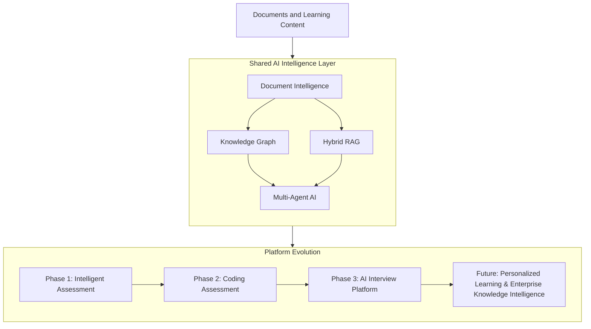

# 🚀 Platform Vision

> **An open-source AI platform for intelligent assessment, adaptive learning, and knowledge intelligence powered by Hybrid RAG, Knowledge Graphs, and Multi-Agent AI.**

  
  
  
  

---

## 🌍 Why This Platform?

Traditional learning is fragmented.

Instead of one intelligent learning ecosystem, we use disconnected platforms for different tasks.

| Domain | Typical Platform |
|---------|------------------|
| 🎓 Students | Mock Tests & Study Apps |
| 👨‍💻 Developers | Coding Practice Platforms |
| 🤝 Recruiters | Technical Interview Systems |
| 🏢 Enterprises | LMS & Knowledge Portals |

Although these platforms solve individual problems, they rarely work together to understand:

- 📚 What a learner already knows
- 🎯 Where knowledge gaps exist
- 📈 How learning should adapt over time
- 🧠 How knowledge can be reused across different workflows

---

## 💡 Our Vision

Rather than building separate AI applications, this platform creates **one shared AI intelligence layer** that powers multiple learning experiences.

Every capability shares the same foundation, allowing the platform to grow without redesigning the underlying architecture.

---

## 👥 Who Is It For?

| 👤 User | 🚀 Platform Capabilities |
|---------|--------------------------|
| 🎓 Students | Adaptive learning, quizzes, knowledge gap analysis |
| 👨‍💻 Developers | Documentation intelligence, coding assessments, AI interviews |
| 💼 Professionals | Upskilling, certification, enterprise knowledge search |
| 👩‍🏫 Educators *(Future)* | Course creation, assessments, learning analytics |
| 🤝 Recruiters *(Future)* | Candidate evaluation, AI-assisted interviews |
| 🏢 Enterprises *(Future)* | Knowledge management, workforce intelligence |

---

## 🏗️ Core Building Blocks

Every capability in the platform is powered by the same reusable AI foundation.

| 🧩 Building Block | 🎯 Purpose |
|-------------------|------------|
| 📄 Document Intelligence | Convert documents into structured knowledge |
| 🧠 Knowledge Graph | Connect concepts, entities, and relationships |
| 🔍 Hybrid RAG | Combine vector, graph, and metadata retrieval |
| 🤖 Multi-Agent AI | Coordinate specialized AI workflows |
| 📝 Adaptive Assessment | Generate personalized assessments |
| 📊 Learning Analytics | Track knowledge growth |
| 🎯 Knowledge Gap Analysis | Identify learning opportunities |

---

## 🛣️ Platform Evolution

The platform will evolve incrementally, with each phase extending the capabilities of the same underlying architecture.

| Phase | Objective |
|--------|-----------|
| 🏗️ **Phase 1** | Intelligent Document Assessment |
| 💻 **Phase 2** | Coding Assessment Platform |
| 🎤 **Phase 3** | AI Interview Platform |

> 💡 Each phase builds upon the previous one without replacing the core architecture.

---

## 🌍 Why Open Source?

Because the best learning infrastructure shouldn't live behind a paywall or a single company's roadmap.

This is designed as a **community-built ecosystem** — where developers, researchers, and educators can plug in new document types, retrieval strategies, agents, or analytics without touching the core. Document intelligence, retrieval, graphs, assessments, and agents all evolve independently, but stay part of one unified platform.

---

## 🚀 Looking Ahead

Phases 1–3 will establish:
- 📄 Document Intelligence
- 📝 Adaptive Assessment
- 💻 Coding Evaluation
- 🎤 AI Interviews

Beyond Phase 3, the same architecture is designed to extend into:
- 🎯 Personalized Learning
- 🏢 Enterprise Knowledge Intelligence

By combining **Hybrid RAG**, **Knowledge Graphs**, and **Multi-Agent AI**, the platform provides a scalable and extensible foundation for the next generation of AI-powered learning and assessment systems.